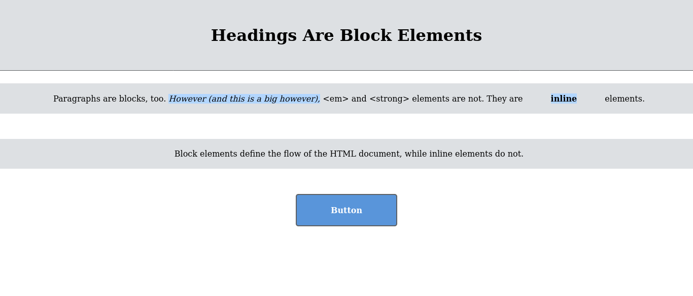

# Interneting Is Hard - CSS Box Model

This is a solution to the [CSS Box Model tutorial No. 5 of HTML & CSS Is Hard](https://www.internetingishard.com/html-and-css/css-box-model/).

## Table of contents

- [Overview](#overview)
  - [Screenshot](#screenshot)
  - [Links](#links)
- [My process](#my-process)
  - [Built with](#built-with)
  - [What I learned](#what-i-learned)
  - [Continued development](#continued-development)
  - [Useful resources](#useful-resources)
- [Author](#author)
- [Acknowledgments](#acknowledgments)

## Overview

### Screenshot



### Links

- Solution URL: [CSS Box Model solution](https://github.com/jugglingdev/css-box-model)
- Live Site URL: [CSS Box Model live site](https://jugglingdev.github.io/css-box-model/)

## My process

### Built with

- Semantic HTML5 markup
- CSS custom properties

### What I learned

I enjoyed this micro view of CSS, learning the differences between block and inline boxes.  I like the box model - content, padding, border, margins.  It makes a lot of sense to me, though I can potentially see places where I may have questions about whether to adjust the padding or margins.

One trick I learned was to add a red border for coding purposes just to see the distinction between each aspect of the box model.  This was super helpful.

Another trick is using the shorthands for padding, border, and margin (see code snippets below) instead of typing out `padding-top`, `padding-right`, etc., recognizing that there's a time and place for both options.

Once again, `em` can come in handy for relative measurements.

An important note is that inline elements don't respond to top and bottom margins, only right and left.  Padding is affected, however, the vertical layout of surrounding boxes is not affected.  Long story short:  If you want to play with vertical space, use blocks.

Another good note is vertical margin collapse: when 2 boxes are vertical margins are against each other, the biggest margin wins (and the smallest one collapses).  If you want the layout of different elements defined as the minimum space between each other, then it's great.  If not, the hack is to put an invisible element between them (see `<div>` below).

My favorite CSS property in this tutorial was `border-radius`.  Now I can finally make pretty buttons!

This next topic I actually came back to and reread when writing this README.md.  Boxes by default set their `height` and `width` by the content of the box. That means padding, border, and margin sizes are all added on top of the explicit `width` and `height`.  That's why it's recommended to reset the default to `box-sizing: border-box`, so the padding and border is included and not just the content.  Pretty neat!

The last topic I learned was centering with auto-margins.  If you set an explicit `width`, then you can set `margin` to something like `20px auto` and it will center. 

New code snippets from this tutorial include:

```css
/* This changes the box type of HTML elements */
.inline-default {
  display: block;
}
```

```css
/* Shorthand - Vertical Horizontal */
.p {
  padding: 20px 10px;
}
```

```css
/* Shorthand - Top Right Bottom Left */
.p {
  padding: 20px 0 20px 10px;
}
```

```css
/* Border Syntax - Size Style Color */
h1 {
  border: 1px solid #5D6063;
}
```

```html
<!-- Take this, margin collapse! -->
<div style="padding-top: 1px"></div>
```

```css
/* Recommended reset */
* {
  margin: 0;
  padding: 0;
  box-sizing: border-box;
}
```

### Continued development

A couple CSS properties mentioned in this tutorial that I would like to look at for future use are `white-space` and `overflow`, both of which can help with explicit dimensions and wrapping.

Centering with floats and flexbox were also mentioned (versus auto-margins), but there are separate tutorials dedicated to those that I'll review later.

### Useful resources

- [MDN White-Space](https://developer.mozilla.org/en-US/docs/Web/CSS/white-space) - Reference for using the CSS white-space property.

- [MDN Overflow](https://developer.mozilla.org/en-US/docs/Web/CSS/overflow) - Reference for using the CSS overflow property.  I find `overflow: scroll` fun to play with.

## Author

- GitHub - [@jugglingdev](https://github.com/jugglingdev)

- freeCodeCamp - [@jugglingdev](https://www.freecodecamp.org/jugglingdev)

- Frontend Mentor - [@jugglingdev](https://www.frontendmentor.io/profile/jugglingdev)

- LinkedIn - [Kayla Paden](https://www.linkedin.com/in/kayla-marie-paden)

## Acknowledgments

Shoutout to Oliver James for his dedication to publishing and maintaining InternetingIsHard.com.  His tutorials were the first that really clicked for me.